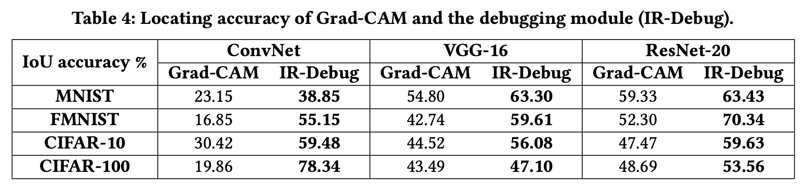

# InputRepair
Code Release and pre-trained models for InputRepair. 

## Introduction

In this paper we describe InputRepair, an on-the-fly input repair technique for detected failure-inducing inputs. It is an input debugging and repairing technique for deep neural networks.

### Repo structure
- `debug.py`: code for find confusing regions from input
- `grad_cam.py`: code for calculating heatmap scores for each layer
- `repair.py`: code for repairing the input regions
- `kdes_generation.py`: code for generating kde values for each layer
- `search_occlusion.py`: code for the crash occlusion position for each testing image on which the original classifier begins to mis-predict
- `store_occlused_data.py`: code to store the occlused testing dataset
- `models/`: pre-trained models
- `tmp/`: temp files
- `images/`: additional results

### Dependencies
- conda create --name myenv
- pip install -r requirements.txt

### How to run

- To locate confusing regions: python debug.py --d "cifar10" --m "conv"
- To repair input: python repair.py --d "cifar10" --m "conv"

### Additional results
We evaluate the accuracy of Grad-CAM and InputRepair's debugging module (IR-Debug) with a set of occluded images that are mis-predicted by the DNN models. As shown in Table 4, IR-Debug always performs better than Grad-CAM. This demonstrates that the debugging module in InputRepair works well in practice.

